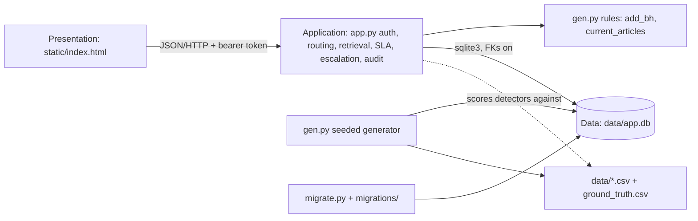

# Architecture

```mermaid
flowchart LR
  UI[Presentation: static/index.html] -->|JSON/HTTP + bearer token| API[Application: app.py auth, routing, retrieval, SLA, escalation, audit]
  API --> RULES[gen.py rules: add_bh, current_articles]
  API -->|sqlite3, FKs on| DB[(Data: data/app.db)]
  GEN[gen.py seeded generator] --> DB
  GEN --> CSV[data/*.csv + ground_truth.csv]
  MIG[migrate.py + migrations/] --> DB
  API -. scores detectors against .-> CSV
```
